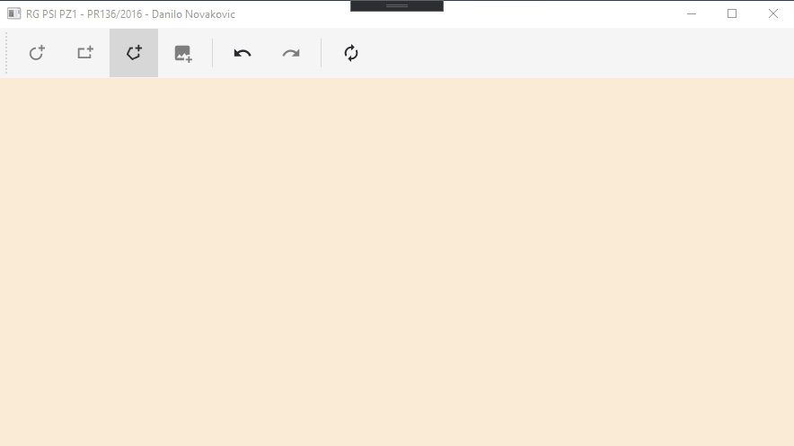

# RG_PSI_PZ1

RG_PSI_PZ1 is a school project, built using WPF.

## Getting Started

Use these instructions to get the project up and running.

### Prerequisites

You will need the following tools:

- [Visual Studio 2017-2019](https://www.visualstudio.com/downloads/)
- [.NET Framework (>=4.6.1)](https://dotnet.microsoft.com/download/dotnet-framework)

> You also need to have C# version enabled which supports `?.` and `??` operators. (Recommended version is C# 7).

### Setup

Follow these steps to get your development environment set up:

  1. Clone the repository
  1. Build solution in Visual Studio (2017 or 2019)
  1. Start Application

## Usage Guide

This section will focus on how to use this application, as well as give brief explanation on what each display does.

Common functionality is that left clicking created item will prompt window to edit created shape.

Right clicking Canvas will prompt window to create selected shape (with exception to [polygon](#polygon))

### Ellipse

### Rectangle

### Polygon

Right clicking on Canvas you create logical "points" after which by left clicking you connect these points into an polygon.

### Image

### Undo Redo Clear  

---

Copyright 2020 © [DaniloNovakovic](https://github.com/DaniloNovakovic)